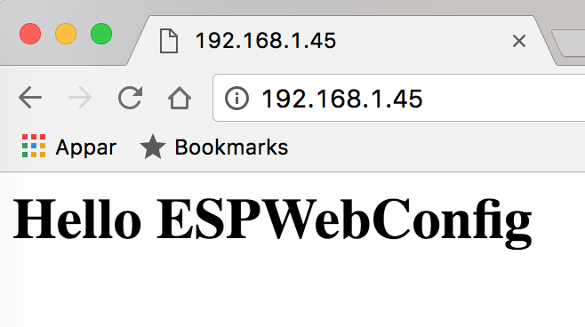

# ESPWebConfig
Arduino web based configuration library for ESP8266 chip.

Configure the device in a web inteface. After first boot it will act as an access point,
so you don't need ssid and password hard coded in your program.

After config and reboot the device will connect to the wifi you configured.
It will get a new IP number.

The wifi stuff above is always there, but you can add extra parameters during config,
that you can use during normal execution. Se examples/CustomWebConfig.

TODO: Prettier.
