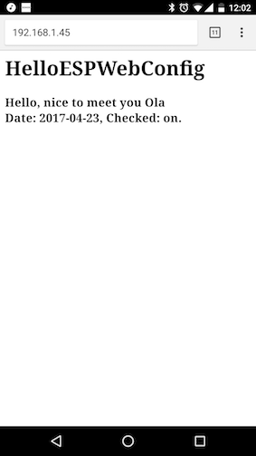

# ESPWebConfig
Arduino web based configuration library for ESP8266 chip.

Configure the wifi of the device in a web inteface. After first boot it will act as an access point,
so you don't need ssid and password hard coded in your program.

## Basics: examples/BasicESPWebConfig

```
ESPWebConfig espConfig;

setup() {
  // Read config and set up wifi.
  // If no config, this function will block, set up an access point and serve config web UI. 
  espConfig.setup();

  // Configuration read and wifi connected
  // Your normal code ...
}
```


After config and reboot the device will connect to the wifi you configured.
It will get a new IP number.

In this example a wifi client is making a call: (Serial output)
```
Configuration done!192.168.1.90
Test wifi connection
Google responded with code 301
```


# More features: examples/CustomESPWebConfig

The wifi stuff above is always there, but you can add extra parameters during config,
that you can use during normal execution.
Add them as an array of strings to the constructor:

```
const char* GREETING_KEY = "Greeting*";
const char* NAME_KEY = "Name";
const char* DATE_KEY = "Date*|date";
const char* CHECK_KEY = "Check|checkbox";

String parameters[] = {GREETING_KEY, NAME_KEY, DATE_KEY, CHECK_KEY};
ESPWebConfig espConfig("configpass", parameters, 4);
```
### Web sugar
Appart from the name you can also set input type and mark a parameter as required in the web UI.

To set a parameter as required, simply add an asterix in the end.

To set input type use the labelname|typename notation, where labelname will be shown in the web UI and typename be used as type for that html input. There is no check that the type is valid or usefull, it will just set type="typename" in the code.
For example "radio" button doesn't work, it requires more stuff in the html code to work. Simple types like date, password and url should work great.


After config you can read the variables with the same key you defined in the setup: `greeting = espConfig.getParameter(GREETING_KEY);`


